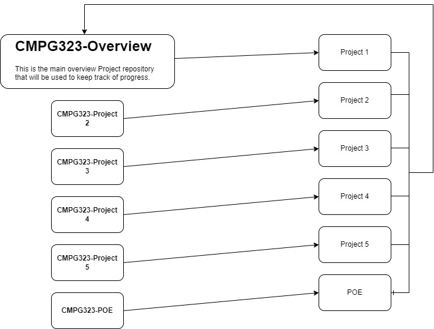

# __CMPG323-Overview-33759472:__

## __Repositories used:__

 For the project I intend to make use of different repositories for each Project along with editing the Main Project repository accordingly.

## __Project/Repository Diagram:__

 

 As shown in the above image, I will make use of a Repository for each new Project which will then be added to the
 overarching Overview Repository.

## __Branching Strategy:__

 During this project I will make use of 2 branches.
 The main will be used when I have finished certain aspects of the Projects in the Develop branch.
 
 * *Main*
 * *Develop*
  

## __Use of .gitignore:__

 Every project I am working on has sensitive information that cannot be accessed from the public. Therefore, I will use the .gitignore to ignore these sensitive files when adding to the repositories.

## __Storage of Credentials:__

 As for the storage of credentials I plan on adding most of my personal credentials to the .gitignore for security reasons.
 But where necessary I will provide the needed credentials in order for the project to work.

## __Refrence List__
 
 This is where I plan to add all the refrences I used in order to complete all of the tasks I need to.